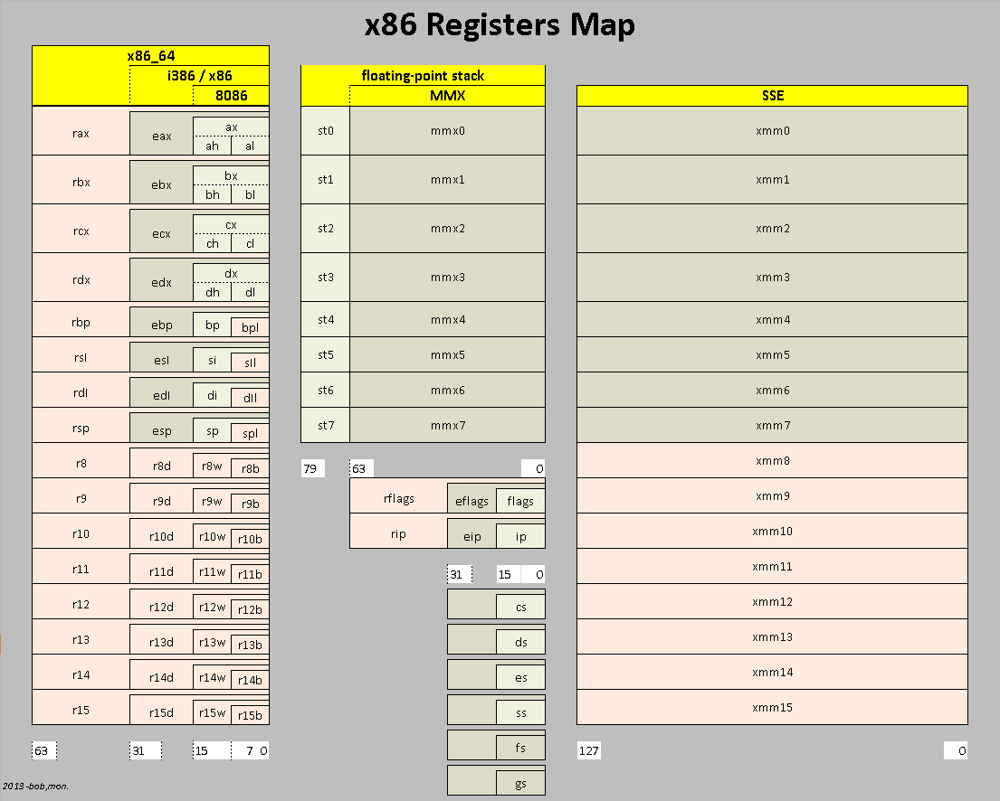

## Disclaimer
I am an enthusiast, not an expert.

# Fizzbuzz, but fast!


## To 1000000000!

## Fixed Width
```
0000000001
```

## Exlamation point!
```
Fizzbuzz!
```


## Tests!
```
$ ./fizzbuzz | ./fizzbuzz-verify
```

## Benchmarking
```
$ time ./fizzbuzz > /dev/null
```

# Competition

## Clojure
```
$ time java -jar target/uberjar/fizzbuzz-clj-0.1.0-SNAPSHOT-standalone.jar > /dev/null
java -jar target/uberjar/fizzbuzz-clj-0.1.0-SNAPSHOT-standalone.jar >   1595.13s user 244.08s system 101% cpu 30:18.40 total
```

## Python
```
$ time ./fizzbuzz.py > /dev/null
./fizzbuzz.py > /dev/null  733.26s user 0.50s system 99% cpu 12:15.15 total
```

## C♯
```
$ time dotnet bin/Debug/netcoreapp2.2/dotnet-fizzbuzz.dll > /dev/null
dotnet bin/Debug/netcoreapp2.2/dotnet-fizzbuzz.dll > /dev/null  661.08s user 227.88s system 99% cpu 14:49.58 total
```

## C
```
$ time ./fizzbuzz-naive > /dev/null
./fizzbuzz-naive > /dev/null  61.52s user 0.48s system 99% cpu 1:02.20 total
```

## JavaScript
```
  node fizzbuzz.js > /dev/null  94.43s user 6.24s system 199% cpu 50.414 total
    ...
```

## JavaScript (sigh)
```
FATAL ERROR: Ineffective mark-compacts near heap limit Allocation failed - JavaScript heap out of memory
 1: 0x55abaeda8761 node::Abort() [node]
 2: 0x55abaedaa255 node::OnFatalError(char const*, char const*) [node]
 3: 0x55abaef50002 v8::Utils::ReportOOMFailure(v8::internal::Isolate*, char const*, bool) [node]
 4: 0x55abaef5025b v8::internal::V8::FatalProcessOutOfMemory(v8::internal::Isolate*, char const*, bool) [node]
 5: 0x55abaf2e7573  [node]
 6: 0x55abaf2e76b4  [node]
 7: 0x55abaf2f7656 v8::internal::Heap::PerformGarbageCollection(v8::internal::GarbageCollector, v8::GCCallbackFlags) [node]
 8: 0x55abaf2f7ffe v8::internal::Heap::CollectGarbage(v8::internal::AllocationSpace, v8::internal::GarbageCollectionReason, v8::GCCallbackFlags) [node]
```

# A couple other C implementations

# Assembly

## Instructions
```
ret
add rax, rbx
sub [rax*2], 1
lea rdi, [rax + rdi*2]

vpaddb ymm0, ymm1, ymm2
```

## Registers



## Subroutines
```
foo:
    add rdi, 1
    ret

bar:
    mov r8, 10
.loop
    call foo
    sub r8, 1
    ret
```

# Here's where the slides end
Cross your fingers.
